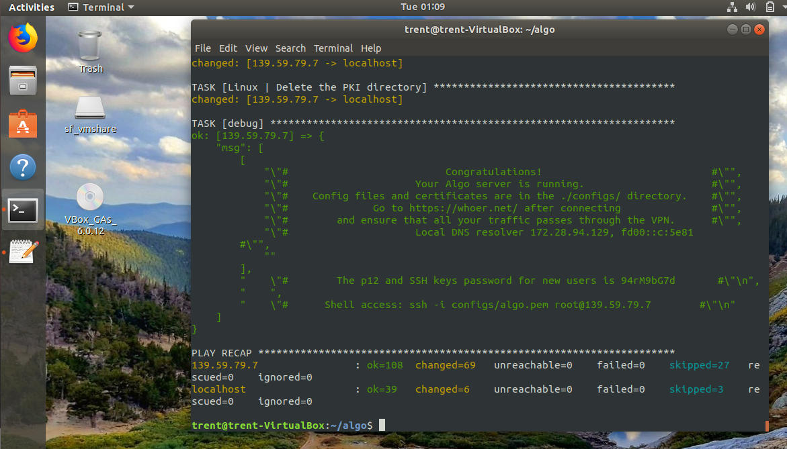
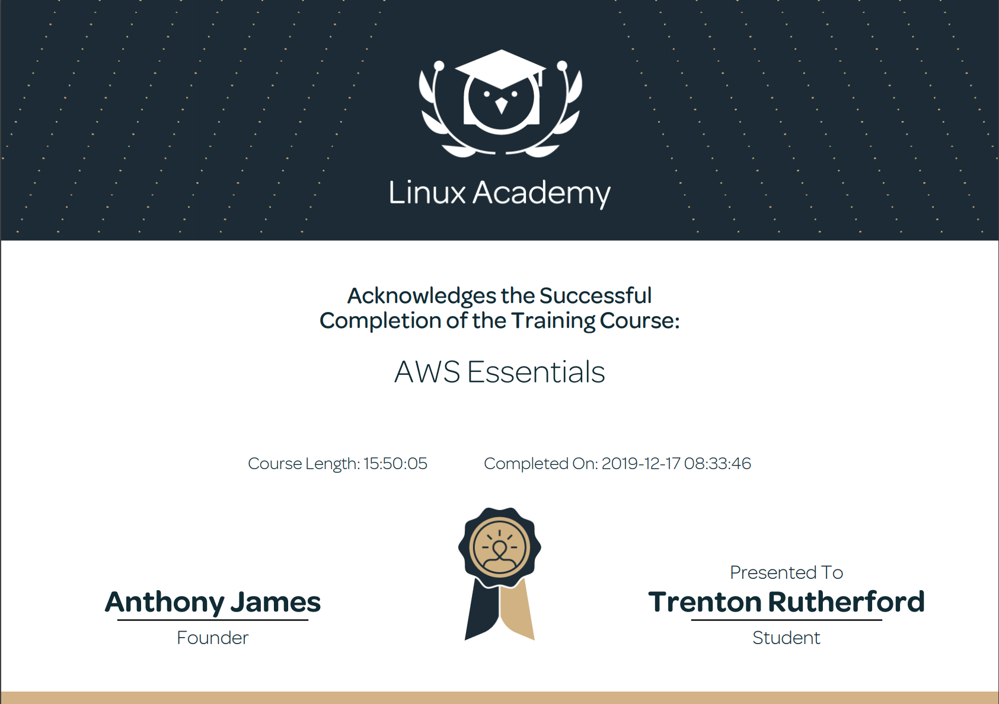

<h3>Hello! My name is Trenton Rutherford and I am currently a senior at the University of Tulsa studying Computer Information Systems. This page will demonstrate some of the technical skills and knowledge I have mastered during my studies here.</h3>

# Education

University of Tulsa - Tulsa, OK        

Kingston University - London, United Kingdom 

Major: Computer Information Systems 

#### Contact Information

Ter759@utulsa.edu
832-338-2862

# Skills and Certifications

## Github

Using Github, I was able to completed a few different courses such as First Day on Github and First Week on Github (pictured below). Both of these helped build a familarity with Github and understand how to create and manage pull requests, and how to create and host my own pages. 

## Linux

 On LinuxAcademy, I completed the course LPI Linux Essentials. Through this course, I learned the basics of the Linux comamnd lines including beginner commands along with their respective parameters, commands to change directories and modify files, commands to view system information, and commands to view and alter users and groups along with permissions. 

 Some of the main topics for this course include:
 <ul>
  <li>Major Open-Source Applications</li>
  <li>Open-Source Software and Licensing</li>
  <li>Command Line Basics</li>
  <li>Using Directories and Listing Files</li>
  <li>Creating, Moving, and Deleting Files</li>
  <li> Archiving Files on the Command Line</li>
  <li>Searching and Extracting Data from Files</li>
  <li>Choosing an Operating System</li>
  <li>Your Computer on the Network</li>
  <li>Basic Security and Identifying User Types</li>
  <li>Managing File Permissions and Ownership</li>
  <li>Special Directories and Files</li>

  
  
Also on Linux, I used Virtual Box and Ubuntu to create my own VPN using Algo VPN scripts. I followed a tuturoial on GitHub to deploy an Algo server, configure VPN clients, create/delete users, and set up a tunnel by using WireGaurd.
  

<h1>PowerBI</h1>

I was able to take an online course using edX called Analyzing and Visualizing Data with Power BI. It covered the topic list pictured below and taaught me how Power BI is used in the workplace and why it is such an important tool. I was able to figure out how to import data into Power BI and what the interface of the application looks like. After learning the basics, I was able to get in some real practice as well. The courses I completed are listed below. 
    
 <ul>
  <li>Managing Data Transformations on the PowerBI Desktop Application</li>
  <li>Desktop Modeling</li>
  <li>Data Visualizations</li>
  <li>Online PowerBI Service</li>
  <li>Excel Data Imports and Direct Connectivity</li>
</ul> 

I also was able to do an analysis of my own called Retail Analysis and after going through all of the data provided, I came up with my own dashboard. Below is a link to a video that has a deeper explanaition for my Dashboard and why I did what I did. 
 <li> <a href="https://www.youtube.com/watch?v=SpcjCcQsoU4&t=2s">Dashboard Video </a>  </li>

<h2>Automation Anywhere</h2>

<ul>
<li> For this task I was able to take a closer look at robotic proces automation. I was able to learn about the different types of bots out there and the different use cases for each. Some of the other topics covered FEasibility Aanalaysis, ROI Analysis, and Bot Development. I never realized how much work is put into figuring out the requirments and justifications of a bot before it can be worked on</li>
  </ul>

<ul>
  <li> This course also covered Robotic Process Management. The focus on this was mainly what it was like to be in charge of an RPA project. It talked about how a manager should be preparing for and understanding the needs of the project. It is very important to full understand what is being built and why it is necessary before any development can start. </li>
 </ul>

## Amazon Web Services (AWS)

 I completed the AWS Essentials course on Linux Academy as an introduction to core AWS services. I created and managed the security of my own AWS account using IAM and got exposure to many of the other features AWS has to offer such as bulk storage and object versioning/lifecycling in S3, SQL/non-SQL based database services in RDS and DynamoDB (respectively), and cloud computing instances with EC2. Through the training's use of an overarching example (referred to as "Project Omega"), I also understand how these services can be used in conjunction with one another to create solutions to a vast array of professional issues. Getting an understanding and familairity with AWS is really important because of how big it is and the fact that almost every big company is using it in one way or another. After completing the AWS Essentials course, I was able to do a few tutiorials that covered IPSec and Open VPN server builds on both Digital Ocean and AWS. 
 Here are the main topics covered in the course:    
 <ul>
  <li>Identity and Access Management (IAM)</li>
  <li>Virtual Private Cloud (VPC)</li>
  <li>Elastic Cloud Compute (EC2)</li>
  <li>Storage Services (S3)</li>
  <li>Databases</li>
  <li>Elastic Load Balancer (ELB)</li>
  <li>Auto Scaling</li>
  <li>Route 53</li>
  <li>Lambda</li>
  <li>General AWS Account Management</li>
</ul> 

 

 

